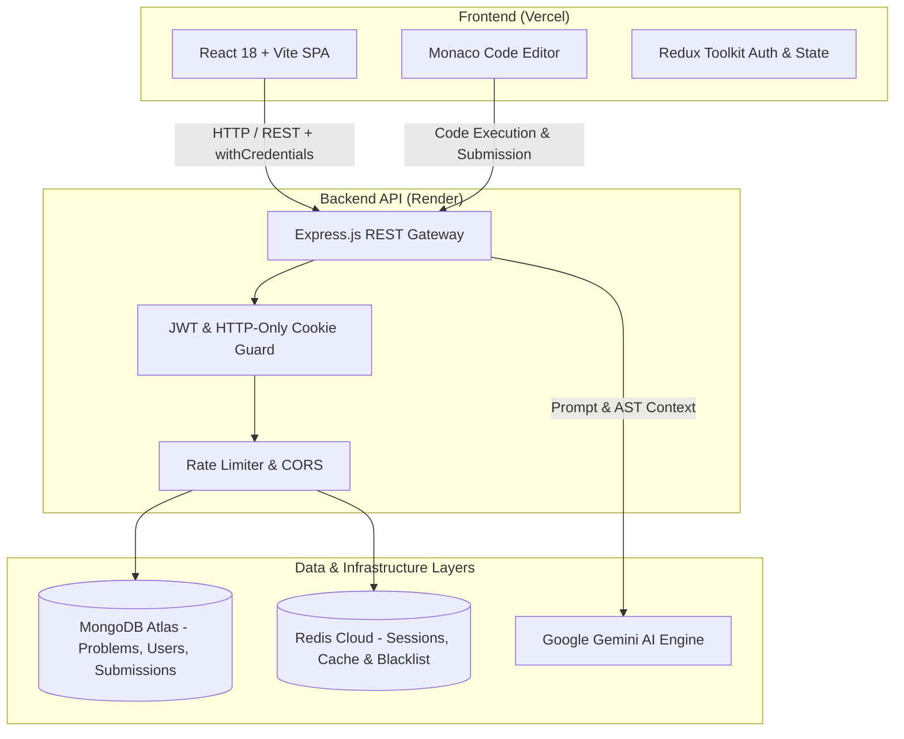

<div align="center">

# CodeBlaze

**AI-Powered Cloud IDE, Algorithmic Problem Solving & Code Intelligence Platform**

[](https://code-blaze-git-main-aryansharma-progs-projects.vercel.app)
[](https://github.com/aryansharma-prog/CodeBlaze)
[](LICENSE)

</div>

---

## 📌 Overview

**CodeBlaze** is a full-stack algorithmic coding and cloud development platform designed to streamline problem-solving, code prototyping, and AI-assisted debugging. The platform integrates the industry-standard **Monaco Editor**, a multi-tier backend with **Redis caching and token blacklisting**, and **Google Gemini AI** for real-time complexity analysis and code explanations.

---

## 🏗️ System Architecture



---

## ⚡ Key Engineering Features

- 💻 **Interactive Monaco Editor**: Syntax highlighting, auto-completion, multi-file code sandboxing, and real-time execution feedback.
- 🤖 **AI Code Intelligence**: Gemini-powered conversational assistant providing time/space complexity analysis, algorithmic hints, and syntax remediation.
- 🚀 **High-Throughput Caching**: Redis-backed session verification, token blacklisting, and frequent problem dataset caching for sub-50ms query latency.
- 🔐 **Hardened Authentication**: Strict HTTP-only cookie JWT strategy, bcrypt password hashing, and role-based access control.
- 📊 **Submission Lifecycle**: Problem catalogs with test-case validation, submission history tracking, and user performance analytics.

---

## 🛠️ Tech Stack

| Layer | Technology |
| :--- | :--- |
| **Frontend** | React.js (Vite), Redux Toolkit, React Router DOM, Tailwind CSS, Monaco Editor, Axios |
| **Backend** | Node.js, Express.js, RESTful APIs, JWT Auth, Bcrypt, CORS |
| **Database & Cache** | MongoDB Atlas (Mongoose ODM), Redis (Upstash / Redis Cloud) |
| **AI Integration** | Google Gemini Generative AI API |
| **Deployment** | Frontend on **Vercel**, Backend on **Render**, Database on **MongoDB Atlas** |

---

## 📡 API Reference

### Authentication & Users
| Method | Endpoint | Description | Auth Required |
| :--- | :--- | :--- | :--- |
| `POST` | `/user/register` | Register a new developer account | No |
| `POST` | `/user/login` | Authenticate user & issue HTTP-only JWT cookie | No |
| `POST` | `/user/logout` | Invalidate session & blacklist token in Redis | Yes |
| `GET` | `/user/check` | Verify session state and return authenticated user | Yes |
| `GET` | `/user/getProfile` | Retrieve user profile, submission history, and stats | Yes |

### Problems & Submissions
| Method | Endpoint | Description | Auth Required |
| :--- | :--- | :--- | :--- |
| `GET` | `/problem/all` | Fetch paginated problem catalog (cached in Redis) | No |
| `GET` | `/problem/:id` | Fetch problem description, constraints & test cases | No |
| `POST` | `/problem/create` | Admin endpoint to publish new challenge | Admin |
| `POST` | `/submission/create` | Execute code against test suites and store result | Yes |

### AI Coding Assistant
| Method | Endpoint | Description | Auth Required |
| :--- | :--- | :--- | :--- |
| `POST` | `/ai/chat` | Generate explanations, hints, or reviews for code snippet | Yes |

---

## 🚀 Local Development Setup

### 1. Prerequisites
- Node.js >= 18.x
- MongoDB Atlas cluster or local MongoDB instance
- Redis instance (Local or Redis Cloud URI)

### 2. Backend Installation

```bash
cd backend
npm install
cp .env.example .env
# Edit .env with your MongoDB, Redis, JWT, and Gemini credentials
npm run dev
```

### 3. Frontend Installation

```bash
cd frontend
npm install
cp .env.example .env
# Set VITE_BACKEND_URL=http://localhost:4000
npm run dev
```

---

## 👨‍💻 Author

**Aryan Sharma**  
- Portfolio: [aryansharma.dev](https://portfolio-amber-rho-jwa3w6ztpg.vercel.app)  
- GitHub: [@aryansharma-prog](https://github.com/aryansharma-prog)  
- LinkedIn: [Aryan Sharma](https://linkedin.com/in/aryan-sharma-b9a4242a3)
